# DDADANG ERD (초안 v0.1)

```mermaid
erDiagram
    member ||--o{ member_agreement : agrees
    member ||--o| member_withdrawal : withdraws
    member ||--o| refresh_token : "has"
    member ||--o{ cgm_connection : connects
    member ||--o{ cgm_reading : owns
    cgm_connection ||--o{ cgm_reading : syncs

    member ||--o{ food : "registers(CUSTOM)"
    member ||--o{ favorite_food : likes
    food ||--o{ favorite_food : ""
    member ||--o{ meal_record : eats
    meal_record ||--|{ meal_record_item : contains
    food ||--o{ meal_record_item : ""
    meal_record ||--o{ meal_record_photo : has

    member ||--o{ glucose_record : "manual(BGM)"
    member ||--o{ weight_record : logs
    member ||--o{ memo_record : writes
    memo_record ||--o{ memo_record_photo : has

    insulin_product ||--o{ member_insulin : ""
    member ||--o{ member_insulin : "my insulin"
    member_insulin ||--o{ insulin_record : ""
    member ||--o{ insulin_record : injects

    member ||--o{ member_medication : "my drug"
    member_medication ||--o{ medication_record : ""
    member ||--o{ medication_record : takes

    exercise ||--o{ exercise_record : ""
    member ||--o{ exercise_record : does

    member {
        bigint id PK
        varchar provider "KAKAO"
        varchar provider_id UK
        varchar name
        date birth_date
        varchar gender "MALE/FEMALE"
        decimal height_cm
        varchar diabetes_type "TYPE1/TYPE2_INSULIN/TYPE2_NO_INSULIN/PRE/GESTATIONAL/NONE"
        int target_glucose_min "mg/dL"
        int target_glucose_max "mg/dL"
        boolean signup_completed "약관 동의 완료"
        boolean onboarding_completed "큐레이션 4step 완료"
        boolean push_glucose_enabled "MO-ALARM"
        boolean marketing_agreed "MO-ALARM"
        varchar status "ACTIVE/WITHDRAWN"
        datetime deleted_at
    }
    member_agreement {
        bigint id PK
        bigint member_id FK
        varchar terms_type "SERVICE/PRIVACY/..."
        varchar terms_version
        boolean agreed
        datetime agreed_at
    }
    member_withdrawal {
        bigint id PK
        bigint member_id FK
        varchar reason
        varchar detail
    }
    refresh_token {
        bigint id PK
        bigint member_id FK "UK"
        varchar token
        datetime expires_at
    }

    cgm_connection {
        bigint id PK
        bigint member_id FK
        varchar provider "CARESENS_AIR/LIBRE"
        varchar external_user_id "isens user_id 등"
        varchar access_token
        varchar refresh_token
        datetime token_expires_at
        varchar sensor_serial
        datetime sensor_started_at "N일차 계산"
        varchar status "CONNECTED/DISCONNECTED"
    }
    cgm_reading {
        bigint id PK
        bigint member_id FK
        bigint cgm_connection_id FK
        varchar serial_number
        bigint seq_number
        datetime measured_at
        int tz_offset
        int stage
        double initial_value
        double value
        double trend_rate
        int trend
        int error_code
        int min_max_flag
    }

    food {
        bigint id PK
        varchar source "DB/CUSTOM"
        bigint member_id FK "CUSTOM일 때 등록자"
        varchar name
        varchar brand
        varchar category "일반식품/가공품"
        decimal serving_amount
        varchar serving_unit "g/ml/개"
        decimal kcal
        decimal carbohydrate_g
        decimal protein_g
        decimal fat_g
        varchar glucose_grade "A+/A/B+/B/F"
    }
    favorite_food {
        bigint id PK
        bigint member_id FK
        bigint food_id FK
    }
    meal_record {
        bigint id PK
        bigint member_id FK
        datetime eaten_at
        varchar memo "max 1000"
    }
    meal_record_item {
        bigint id PK
        bigint meal_record_id FK
        bigint food_id FK
        decimal amount
        varchar unit
        decimal kcal "기록 시점 스냅샷"
        decimal carbohydrate_g
        decimal protein_g
        decimal fat_g
    }
    meal_record_photo {
        bigint id PK
        bigint meal_record_id FK
        varchar image_url
        int sort_order "max 10장"
    }

    glucose_record {
        bigint id PK
        bigint member_id FK
        datetime measured_at
        int value_mg_dl
        varchar memo
    }
    weight_record {
        bigint id PK
        bigint member_id FK
        datetime measured_at
        decimal weight_kg
    }
    memo_record {
        bigint id PK
        bigint member_id FK
        datetime recorded_at
        varchar content "max 1000"
    }
    memo_record_photo {
        bigint id PK
        bigint memo_record_id FK
        varchar image_url
        int sort_order
    }

    insulin_product {
        bigint id PK
        varchar name "노보래피드플렉스펜주 등"
        varchar action_type "RAPID/SHORT/INTERMEDIATE/LONG/MIXED"
    }
    member_insulin {
        bigint id PK
        bigint member_id FK
        bigint insulin_product_id FK
        decimal default_dose_unit "U"
        datetime deleted_at
    }
    insulin_record {
        bigint id PK
        bigint member_id FK
        bigint member_insulin_id FK
        datetime injected_at
        decimal dose_unit "U"
        varchar memo
    }

    member_medication {
        bigint id PK
        bigint member_id FK
        varchar category "DIABETES/HYPERLIPIDEMIA/HYPERTENSION/SUPPLEMENT/ETC"
        varchar product_name "선택 입력"
        datetime deleted_at
    }
    medication_record {
        bigint id PK
        bigint member_id FK
        bigint member_medication_id FK
        datetime taken_at
        varchar memo
    }

    exercise {
        bigint id PK
        varchar name
        decimal met "kcal 계산용"
        boolean popular
    }
    exercise_record {
        bigint id PK
        bigint member_id FK
        bigint exercise_id FK
        datetime performed_at
        int duration_min
        decimal kcal
        varchar memo
    }
```

## 도메인 구분

| 도메인 | 테이블 | 역할 |
|---|---|---|
| **member** | member, member_agreement, member_withdrawal, refresh_token | 가입·탈퇴, 프로필, 목표 혈당, 알림 설정 |
| **glucose** | cgm_connection, cgm_reading | 센서 연결·동기화, 그래프 지표 계산 |
| **record** | food, favorite_food, meal_record, meal_record_item, meal_record_photo, insulin_product, member_insulin, insulin_record, member_medication, medication_record, exercise, exercise_record, glucose_record, weight_record, memo_record, memo_record_photo | 사용자가 직접 입력하는 기록 7종 |
| **home** | (테이블 없음) | 오늘의 기록 타임라인, 큐레이션 카드 |

- 기준: 센서가 자동 수집하는 데이터는 glucose, 사용자가 입력하는 데이터는 record.
- 의존 방향: `home → glucose, record → member`. glucose와 record는 서로 참조하지 않고, 둘 다 필요한 로직은 home에서 조합한다.
- 수기 혈당(`glucose_record`)은 입력·수정·타임라인 흐름이 다른 기록과 같아서 record에 둔다.
- 내 인슐린·내 복용약, 음식·인슐린·운동 목록은 기록할 때만 쓰이므로 record에 둔다.

## 설계 메모
- **기록 7종은 테이블 분리.** 홈 "오늘의 기록" 타임라인은 날짜 기준으로 각 테이블을 조회해서 서비스 레이어에서 시간순으로 병합한다.
- **기존 CGM 테이블 변경:** `cgm_token`은 `cgm_connection`으로 흡수하고, `cgm_reading.isens_user_id`는 `member_id` + `cgm_connection_id`로 바꾼다. UK는 `(cgm_connection_id, serial_number, seq_number)`.
- **홈 그래프 지표**(혈당 점수, 최고/평균 혈당, 스파이크 횟수, 탄수화물)는 저장하지 않고 `cgm_reading`과 `meal_record_item`에서 계산한다. 성능 문제가 생기면 일별 집계 테이블(`daily_glucose_summary`)을 추가한다.
- **식사 기록 영양소는 스냅샷으로 저장.** 음식 DB 값이 바뀌어도 과거 기록은 유지된다.
- **큐레이션 카드**(식사 확인, 산책 제안, 식간 관리)는 조회 시점에 규칙으로 계산하므로 테이블이 필요 없다.
- **보류:** 농장(MO-FARM), 멤버십, 공지사항, 혈당 반응 예측(MO-GLUCOSE 등급/스파이크 예측)은 기획이 확정되면 추가한다.
